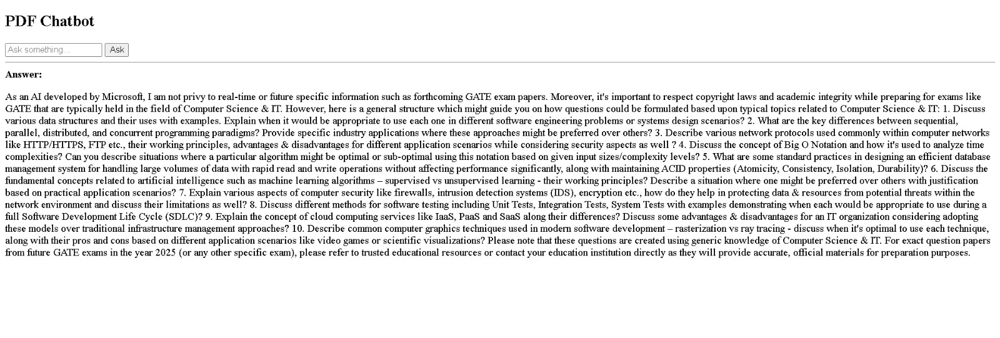

```md
# 📄 PDF RAG Chatbot (Django + Ollama + FAISS)

A Retrieval Augmented Generation (RAG) based PDF Chatbot built using **Python, Django, Ollama, FAISS**, and **HuggingFace embeddings**.  
Users can upload PDF documents and ask questions — the system retrieves relevant content and generates answers locally using LLM.

This project runs completely **offline** using Ollama.
```
---

## 🚀 Features

- Chat with PDF documents
- Local LLM using Ollama (TinyLlama / Phi-3 Mini)
- FAISS Vector Database
- HuggingFace sentence embeddings
- Django Web Interface
- Fully Offline AI System
- Lightweight (8GB RAM compatible)

---

## 🛠 Tech Stack

- Python
- Django
- Ollama
- FAISS
- LangChain
- HuggingFace Sentence Transformers
- HTML

---

## 📁 Project Structure

```

pdf_rag/
│
├── data/                 # PDF files
├── vectorstore/         # FAISS index (auto-generated)
├── chatbot/             # Django app
├── ragweb/              # Django project
├── ingest.py            # PDF ingestion script
├── chat.py              # CLI chatbot
├── venv/                # Virtual environment
└── manage.py

````

---

## ⚙️ Setup Instructions

### 1️⃣ Clone Repository

```bash
git clone <your-repo-url>
cd pdf_rag
````

---

### 2️⃣ Create Virtual Environment

```bash
python -m venv venv
venv\Scripts\activate
```

---

### 3️⃣ Install Dependencies

```bash
pip install django langchain langchain-community faiss-cpu pypdf sentence-transformers ollama
```

---

### 4️⃣ Install Ollama & Model

Download Ollama from:

[https://ollama.com](https://ollama.com)

Pull lightweight model:

```bash
ollama pull tinyllama
```

---

### 5️⃣ Add PDFs

Place PDF files inside:

```
data/
```

---

### 6️⃣ Create Vector Database

```bash
python ingest.py
```

---

### 7️⃣ Run Django Server

```bash
cd ragweb
python manage.py runserver
```

Open browser:

```
http://127.0.0.1:8000/
```

---

## 🧠 How It Works

1. PDFs are loaded and chunked
2. Text is converted to embeddings
3. Stored in FAISS vector DB
4. User query retrieves relevant chunks
5. Ollama LLM generates answer from context

---

## 💡 Use Cases

* Study Assistant
* College Notes Chatbot
* Personal Knowledge Base
* Document QA System
* Portfolio AI Project

---
---

## 📸 Screenshots


---

## 🙌 Author

Name : Singidi Sai Naga Sudheeer

---

## ⭐ Acknowledgements

* Ollama
* LangChain
* HuggingFace
* Django

---
